# Concurrency-aware Algorithm Design for ZNS SSDs

## Repository Structure

## Setup instructions
1. Clone the repository including its submodules/dependencies
    ```bash
    git clone --recurse-submodules https://github.com/rkulskis/cs561-zns.git
    ```
2. Get the [VM image](https://forms.gle/nEZaEe2fkj5B1bxt9) and unzip into `~/images`
3. Compile FEMU using `run_tests.sh`
   ```bash
   # only Debian/Ubuntu based distributions supported
	 # We are on: Linux n0 6.5.0-44-generic #44-Ubuntu SMP PREEMPT_DYNAMIC Fri Jun  7 15:10:09 UTC 2024 x86_64 x86_64 x86_64 GNU/Linux
   cd cs561-zns/scipts
   ./run_tests.sh
	 python3 graph.py
   ```

## IOPS Graphs

For inter-zone concurrency we scale by number of jobs=threads. For intra-zone
concurrency we scale by iodepth within a zone. We measure roughly a uniform
set of $(\alpha, k)$ across all zone geometries listed below with
$(6,64)$ for inter-zone and $(7,2)$ for intra-zone.

### FU_ZONE
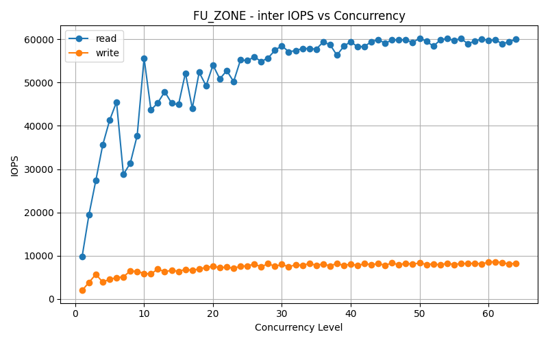
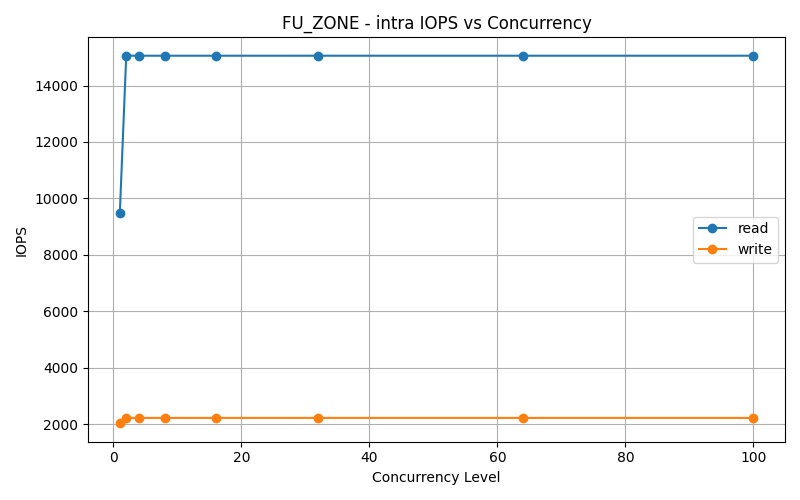

### MU4_ZONE
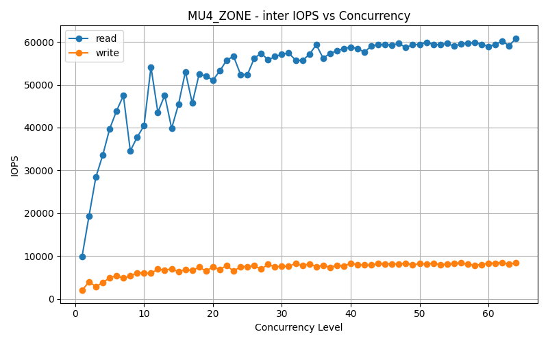
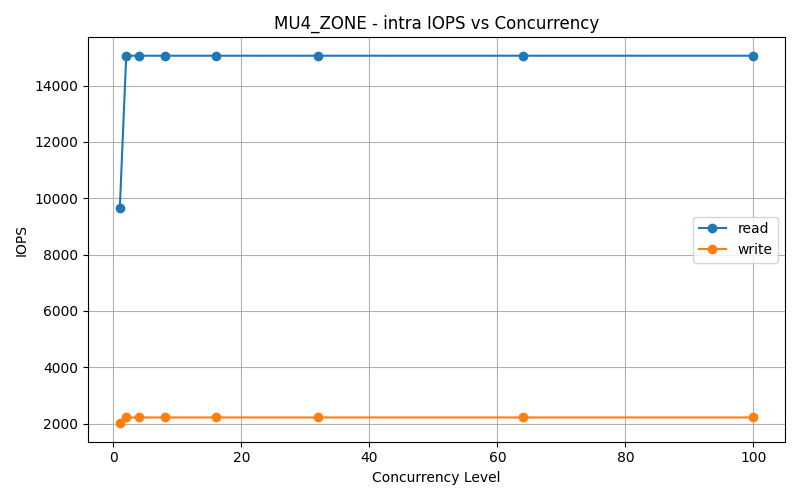

### MU8_ZONE
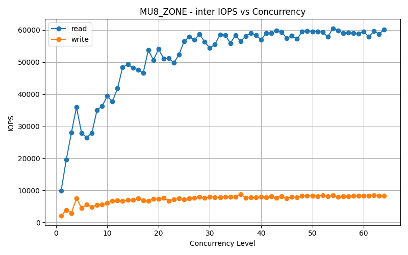
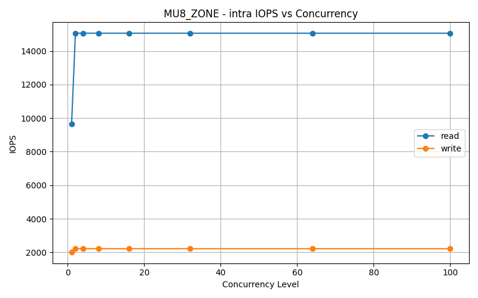

### SU_ZONE
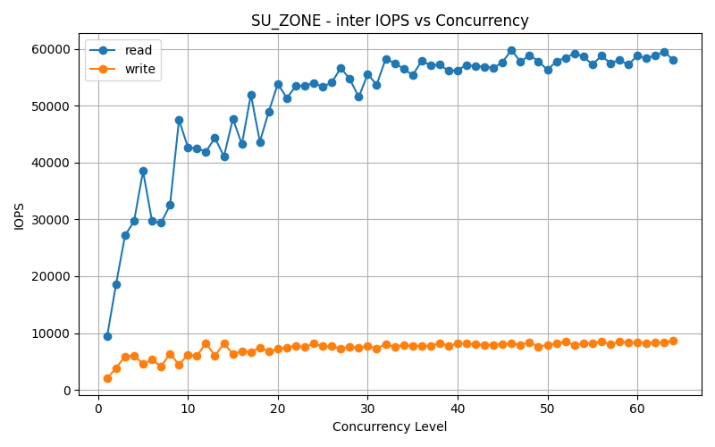
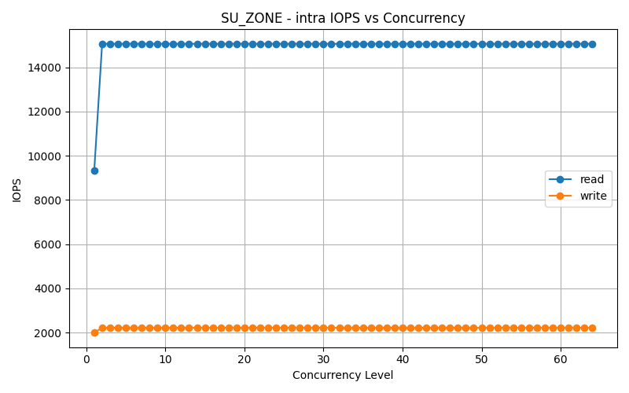

## Disk Utilization Graphs

### Inter
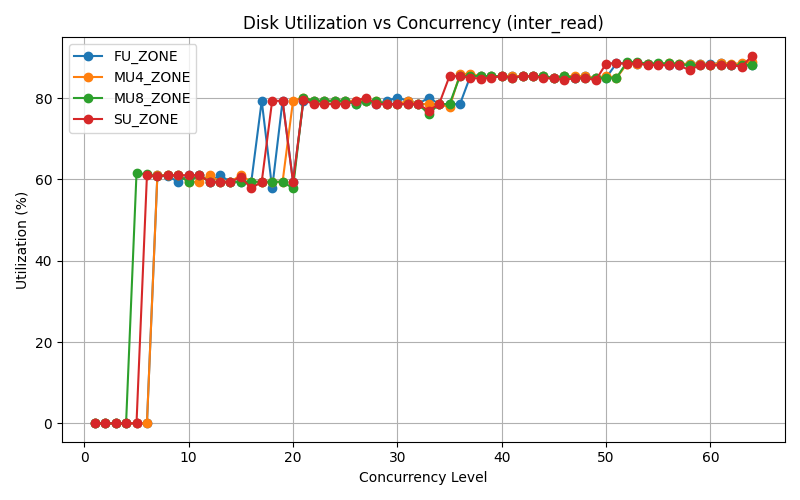
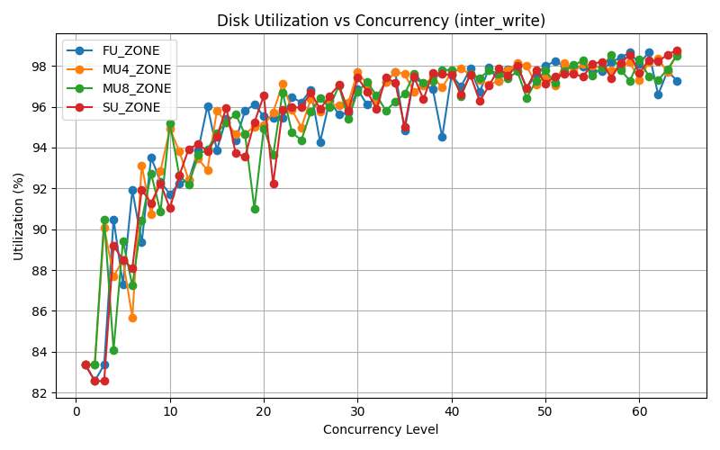

### Intra
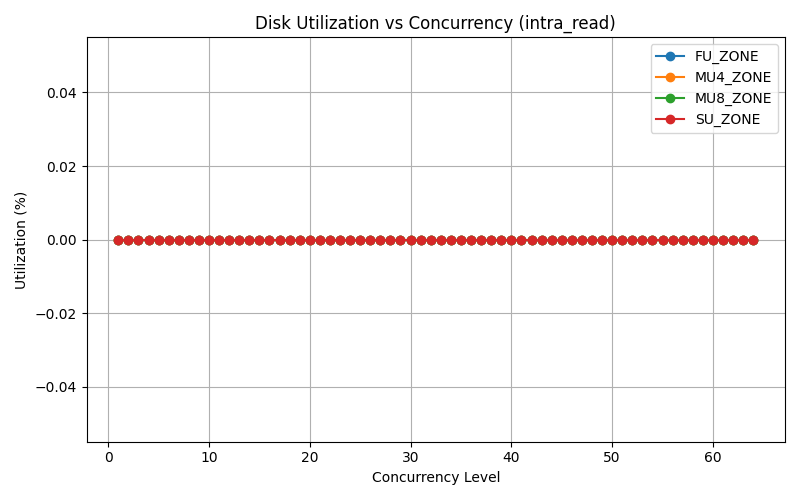
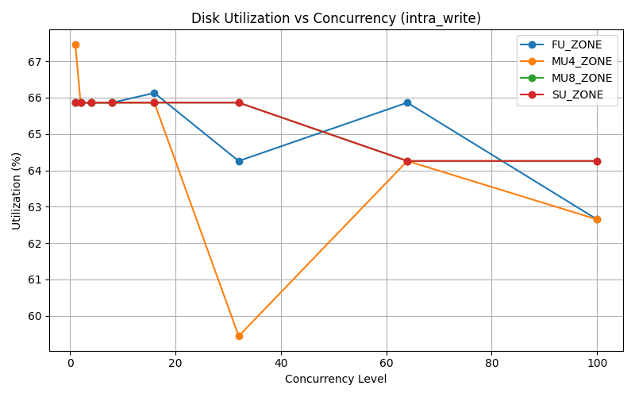
